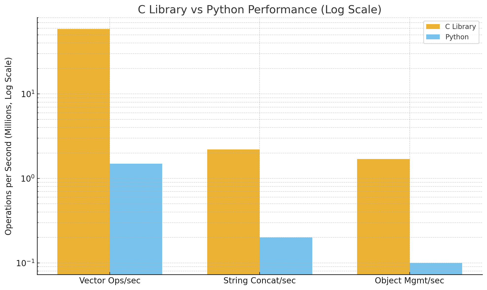

# Generic Vector and String Library

A comprehensive C library providing a type-safe generic vector implementation and a dynamic string class built on top of it. This library demonstrates modern C programming techniques with memory management, generic programming, and extensible design patterns.



## Features

### 🚀 Generic Vector (`genVec`)
- **Type-agnostic**: Works with any data type through `void*` and size parameters
- **Dynamic resizing**: Automatic growth and shrinkage based on usage patterns
- **Memory efficient**: Smart capacity management with configurable growth/shrink ratios
- **Comprehensive API**: Push, pop, insert, remove, access operations
- **Custom cleanup**: Support for custom destructor functions for complex types
- **Copy support**: Deep copying with proper memory management
- **Bounds checking**: Safe operations with comprehensive error handling

### 📝 Dynamic String (`String`)
- **Vector-based**: Built on top of the generic vector for consistent memory management
- **Null-terminated**: Always maintains proper C string compatibility
- **Rich API**: Append, insert, remove, search, substring operations
- **Memory safe**: Automatic buffer management with bounds checking
- **String operations**: Compare, find, replace, and manipulation functions
- **C-string interoperability**: Seamless conversion to/from standard C strings

## 📦 Installation

### Building from Source

```bash
# Clone or download the source files
# Compile the library objects
gcc -c gen_vector.c -o gen_vector.o -O2
gcc -c String.c -o String.o -O2

# Compile your program with the library
gcc main.c gen_vector.o String.o -o my_program

# Or compile directly
gcc main.c gen_vector.c String.c -o my_program
```

## 🎯 Quick Start

### Generic Vector Example

```c
#include "gen_vector.h"
#include <stdio.h>

// Print function for integers
void print_int(const void* element) {
    printf("%d", *(int*)element);
}

int main() {
    // Create vector of integers with custom destructor (NULL for primitive types)
    genVec* vec = genVec_init(0, sizeof(int), NULL);
    
    // Add elements
    int values[] = {10, 20, 30, 40, 50};
    for (int i = 0; i < 5; i++) {
        genVec_push(vec, &values[i]);
    }
    
    // Print vector contents
    printf("Vector contents: ");
    genVec_print(vec, print_int);
    
    // Access elements
    int value;
    genVec_get(vec, 2, &value);
    printf("Element at index 2: %d\n", value);
    
    // Remove last element
    genVec_pop(vec, &value);
    printf("Popped value: %d\n", value);
    
    // Clean up
    genVec_destroy(vec);
    return 0;
}
```

### String Class Example

```c
#include "String.h"
#include <stdio.h>

int main() {
    // Create strings
    String* str1 = string_from_cstr("Hello, ");
    String* str2 = string_from_cstr("World!");
    
    // Concatenate strings
    string_append_string(str1, str2);
    
    // Print results
    printf("Result: %s\n", string_to_cstr(str1));
    printf("Length: %zu\n", string_len(str1));
    
    // String operations
    int pos = string_find_cstr(str1, "World");
    printf("'World' found at position: %d\n", pos);
    
    // Create substring
    String* substr = string_substr(str1, 0, 5);
    printf("Substring: %s\n", string_to_cstr(substr));
    
    // Clean up
    string_destroy(str1);
    string_destroy(str2);
    string_destroy(substr);
    return 0;
}
```

## 📚 API Reference

### Generic Vector API

#### Memory Management
- `genVec* genVec_init(size_t n, size_t data_size, genVec_delete_fn del_fn)` - Create new vector
- `genVec* genVec_init_val(size_t n, const void* val, size_t data_size, genVec_delete_fn del_fn)` - Create with initial values
- `void genVec_destroy(genVec* vec)` - Destroy vector and free memory
- `void genVec_clear(genVec* vec)` - Clear all elements
- `void genVec_reserve(genVec* vec, size_t new_capacity)` - Pre-allocate memory

#### Element Operations
- `void genVec_push(genVec* vec, const void* data)` - Add element to end
- `int genVec_pop(genVec* vec, void* popped)` - Remove last element
- `void genVec_get(genVec* vec, size_t i, void* out)` - Get element at index
- `void genVec_replace(genVec* vec, size_t i, const void* data)` - Replace element at index
- `void genVec_front(genVec* vec, void* out)` - Get first element
- `void genVec_back(genVec* vec, void* out)` - Get last element
- `void genVec_remove(genVec* vec, size_t i)` - Remove element at index

#### Utility Functions
- `genVec* genVec_copy(genVec* src)` - Create deep copy of vector
- `void genVec_print(genVec* vec, genVec_print_fn fn)` - Print vector contents

### String API

#### Construction/Destruction
- `String* string_create(void)` - Create empty string
- `String* string_from_cstr(const char* cstr)` - Create from C string
- `String* string_from_string(const String* other)` - Create from another String
- `void string_reserve(String* str, size_t capacity)` - Pre-allocate buffer space
- `void string_destroy(String* str)` - Destroy string and free memory

#### Basic Properties
- `size_t string_len(const String* str)` - Get string length (excluding null terminator)
- `int string_empty(const String* str)` - Check if string is empty
- `const char* string_to_cstr(const String* str)` - Get C string representation

#### Modification
- `void string_append_cstr(String* str, const char* cstr)` - Append C string
- `void string_append_string(String* str, const String* other)` - Append String
- `void string_append_char(String* str, char c)` - Append single character
- `void string_remove_char(String* str, size_t i)` - Remove character at index
- `void string_clear(String* str)` - Clear string content
- `void string_set_char(String* str, size_t i, char c)` - Set character at index

#### Access and Search
- `char string_at(const String* str, size_t i)` - Get character at index
- `int string_find_char(const String* str, char c)` - Find first occurrence of character
- `int string_find_cstr(const String* str, const char* substring)` - Find substring

#### Comparison
- `int string_compare(const String* str1, const String* str2)` - Compare strings (like strcmp)
- `int string_equals(const String* str1, const String* str2)` - Check string equality
- `int string_equals_cstr(const String* str, const char* cstr)` - Compare with C string

#### Advanced Operations
- `String* string_substr(const String* str, size_t start, size_t length)` - Extract substring
- `void string_print(const String* str)` - Print string with quotes

## 🔧 Advanced Usage

### Working with Custom Data Types

```c
#include "gen_vector.h"
#include <stdio.h>
#include <stdlib.h>
#include <string.h>

typedef struct {
    int id;
    char* name;
    double salary;
} Employee;

// Custom destructor for Employee
void employee_destroy(const void* element) {
    Employee* emp = (Employee*)element;
    free(emp->name);  // Free dynamically allocated name
}

// Custom print function for Employee
void employee_print(const void* element) {
    const Employee* emp = (const Employee*)element;
    printf("Employee{id: %d, name: \"%s\", salary: $%.2f}", 
           emp->id, emp->name, emp->salary);
}

int main() {
    // Create vector of Employees with custom destructor
    genVec* employees = genVec_init(0, sizeof(Employee), employee_destroy);
    
    // Add employees
    Employee emp1 = {1, strdup("John Doe"), 75000.0};
    Employee emp2 = {2, strdup("Jane Smith"), 82000.0};
    
    genVec_push(employees, &emp1);
    genVec_push(employees, &emp2);
    
    // Print all employees
    printf("Employee list:\n");
    genVec_print(employees, employee_print);
    
    // Access specific employee
    Employee retrieved;
    genVec_get(employees, 0, &retrieved);
    printf("\nFirst employee: %s\n", retrieved.name);
    
    // Clean up - destructor will free the names
    genVec_destroy(employees);
    return 0;
}
```

### Vector of Strings

```c
#include "gen_vector.h"
#include "String.h"
#include <stdio.h>

// Print function for String pointers
void string_ptr_print(const void* element) {
    String* str = *(String**)element;
    string_print(str);
}

// Destructor for String pointers
void string_ptr_destroy(const void* element) {
    String** str_ptr = (String**)element;
    string_destroy(*str_ptr);
}

int main() {
    // Create vector of String pointers
    genVec* string_vec = genVec_init(0, sizeof(String*), string_ptr_destroy);
    
    // Create and add strings
    String* str1 = string_from_cstr("Hello");
    String* str2 = string_from_cstr("World");
    String* str3 = string_from_cstr("!");
    
    genVec_push(string_vec, &str1);
    genVec_push(string_vec, &str2);
    genVec_push(string_vec, &str3);
    
    // Print the string vector
    printf("String vector: ");
    genVec_print(string_vec, string_ptr_print);
    
    // Clean up - vector destructor will destroy all strings
    genVec_destroy(string_vec);
    return 0;
}
```

### Performance Tips

```c
// Pre-allocate memory when you know the expected size
genVec* large_vec = genVec_init(1000, sizeof(int), NULL);
String* long_str = string_create();
string_reserve(long_str, 4096);  // Pre-allocate 4KB

// Use bulk operations when possible
for (int i = 0; i < 1000; i++) {
    genVec_push(large_vec, &i);
}

// Reuse vectors when possible instead of creating new ones
genVec_clear(large_vec);  // Clear and reuse
```

## 🏗️ Architecture

### Design Philosophy

This library follows several key design principles:

1. **Type Safety**: Generic programming using `void*` with size information
2. **Memory Management**: Consistent ownership patterns and automatic cleanup
3. **Error Resilience**: Comprehensive error checking with informative messages
4. **Extensibility**: Function pointers enable custom behavior for different data types
5. **Performance**: Smart resizing algorithms minimize expensive reallocations

### Memory Layout

```
genVec Structure (64-byte aligned):
┌─────────────┬──────────────┬──────────────┬──────────────┬─────────────┐
│ void* data  │ size_t size  │ size_t cap   │ size_t d_size│ del_fn ptr  │
└─────────────┴──────────────┴──────────────┴──────────────┴─────────────┘
                     ↑
                     Stores elements of type `data_size`

String Structure:
┌─────────────────┐
│ genVec* buffer  │  → Points to vector of chars (always null-terminated)
└─────────────────┘
```

### Growth Strategy

The vector uses an intelligent resizing strategy:

- **Initial Growth**: Small vectors (capacity < 4) grow by +1 element
- **Exponential Growth**: Larger vectors grow by factor of 1.5×
- **Automatic Shrinking**: Vectors shrink when usage drops below 25% capacity
- **Capacity Preservation**: `genVec_reserve()` only grows, never shrinks

## 🐛 Debugging

The library provides extensive error messages:

```c
// Example error outputs:
"push: vec is null"
"pop: vec is empty" 
"get: index out of bounds"
"replace: need a valid data variable"
```

## 🔮 Future Enhancements

- [ ] Iterator support for safe traversal
- [ ] Bulk operations (insert/remove ranges)
- [ ] String formatting functions (sprintf-like)
- [ ] Unicode support for String class
- [ ] Thread-safety options
- [ ] Serialization/deserialization support
- [ ] Memory pool allocation for better performance
- [ ] Template-based C++ wrapper

## 📄 License

This library is provided as educational software. Feel free to use and modify for your projects.

## 🤝 Contributing

While this is primarily an educational codebase, suggestions and improvements are welcome!

---

**Happy Coding!** 🎉
